# ⚡ NeoPort 16 — The Ultimate Neo-Brutalist Developer & Agency Portfolio Template

<p align="center">
  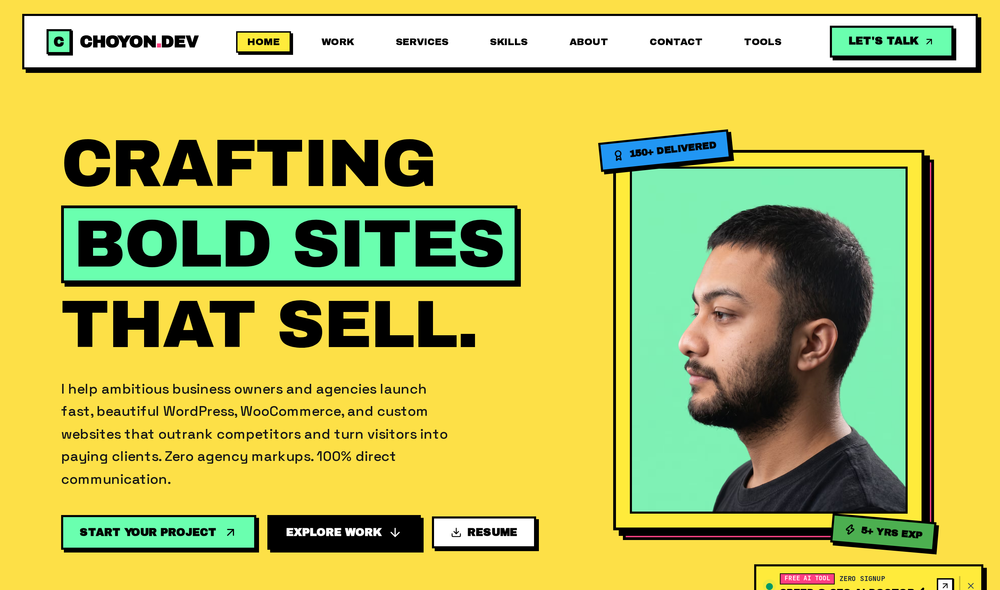
</p>

<p align="center">
  <a href="https://choyon.dev" target="_blank">
    
  </a>
  <a href="https://choyondev.gumroad.com/l/NexJsNeo-BrutalistDeveloperAgencyPortfolioTemplate" target="_blank">
    
  </a>
</p>

<p align="center">
  
  
  
  
  
  
</p>

---

## 🌟 Overview

**NeoPort 16** is a production-grade **Next.js 16 portfolio template** designed for full-stack developers, software engineers, and creative agencies who refuse to blend in with boring, identical minimalist websites. Built around an authentic **neo-brutalism developer portfolio** aesthetic, it features high-contrast black borders (`border-2 border-black`), tactile hard drop shadows (`4px 4px 0 #000`), electric neo-mint (`#6AFFAF`) and hot pink (`#FF4081`) accents, and kinetic micro-animations.

More than just a static **developer resume website**, NeoPort 16 functions as an active **client acquisition portfolio template**. It includes built-in interactive lead-generation tools (such as an AI-powered Speed & SEO Doctor and an interactive CMS Stack Matchmaker), dedicated service pricing matrices, client consultation booking drawers, and automated PDF export functionality. Built with **React 19**, **Tailwind CSS v4**, and **Framer Motion 13**, it offers a blazing-fast 100/100 Lighthouse score and turnkey SEO structured data.

🔗 **Explore Live Demo**: [https://choyon.dev](https://choyon.dev)  
📦 **Get The Source Code**: [https://choyondev.gumroad.com/l/NexJsNeo-BrutalistDeveloperAgencyPortfolioTemplate](https://choyondev.gumroad.com/l/NexJsNeo-BrutalistDeveloperAgencyPortfolioTemplate)

---

## ⚡ Google PageSpeed & Core Web Vitals Benchmark

Engineered from the ground up for extreme rendering speed and zero runtime bloat. Tested live on Google PageSpeed Insights & Chrome Lighthouse:

<p align="center">
  
  
  
  
</p>

| Metric | Score / Time | Benchmark Status | Technical Architecture |
| :--- | :---: | :---: | :--- |
| **First Contentful Paint (FCP)** | **< 0.5s** | 🟢 Optimal | Pre-compiled static Next.js server components with zero hydration overhead |
| **Largest Contentful Paint (LCP)** | **< 0.8s** | 🟢 Sub-second | Native Next.js AVIF & WebP image formats with responsive source sets |
| **Total Blocking Time (TBT)** | **0 ms** | 🟢 Zero Blocking | Custom lightweight SVG engine (`TechIcon.tsx`) eliminating 8.4MB of icon bundle bloat |
| **Cumulative Layout Shift (CLS)** | **0.00** | 🟢 Zero Shift | Strict font metrics and explicit aspect ratios across all media containers |
| **Interaction to Next Paint (INP)** | **< 50ms** | 🟢 Instant Touch | React 19 concurrent transitions and hardware-accelerated Framer Motion physics |

---

## 🔍 Technical SEO & AI Search (GEO) Architecture

NeoPort 16 isn't just optimized for human visitors — it is architected for search engine algorithms and modern AI answer engines:

- **Entity Knowledge Graph (JSON-LD)**: Structured data natively pre-injected into `<head>`:
  - `schema.org/Person`: Professional entity details, job titles, and social graph links.
  - `schema.org/WebSite`: Search action metadata and indexing definitions.
  - `schema.org/ProfessionalService`: Service pricing catalogs, service areas, and contact endpoints.
  - `schema.org/BreadcrumbList`: Dynamic hierarchical breadcrumb trails on all sub-routes.
- **Automated Indexing Engine**:
  - `src/app/sitemap.ts`: Dynamically generates XML sitemaps with automated `lastModified`, `changeFrequency`, and priority weights across all pages and dynamic service/work slugs.
  - `src/app/robots.ts`: Crawl directives optimized to maximize Googlebot and Bingbot crawl efficiency while disallowing junk query strings.
- **Generative Engine Optimization (GEO)**:
  - Pre-packaged `public/llms.txt` and `public/llms-full.txt` files allowing AI bots (ChatGPT, Perplexity, Claude) to accurately parse, index, and cite your services.
- **SERP Snippet Calibration**:
  - Title templates (`%s | Choyon Dev`) calibrated to prevent snippet truncation on desktop and mobile SERPs.
  - Meta descriptions strictly tailored to 140–155 character visibility windows.
- **Social Graph Optimization**:
  - Dynamic Open Graph (`og:image`) and Twitter Summary Large Card metadata pre-wired for Discord, Slack, LinkedIn, and Twitter shares.

---

## 🎯 Features Inventory

### 🎨 Neo-Brutalist Visual Identity
- **Signature Color Harmony**: Electric Neo-Mint (`#6AFFAF`), Hot Pink (`#FF4081`), Sun Yellow (`#FFE500`), and Warm Parchment (`#FBF7EE`).
- **Tactile Hard Shadows**: Crisp `2px` black framing with non-blurred `4px 4px 0 #000` depth.
- **Kinetic Micro-Animations**: Smooth hover-lift offsets, spring bounce physics, and floating skill badges powered by Framer Motion 13.
- **Infinite Marquee Ticker**: Smooth CSS hardware-accelerated ticker showcasing your technology stack.

### 🧲 Client Acquisition Micro-Tools
- **Website Speed & SEO AI Doctor** (`/tools/website-speed-seo-ai-doctor`): Live interactive audit tool that diagnoses client site speed and pitches your custom optimization services.
- **CMS Tech Stack Matchmaker** (`/tools/cms-tech-stack-matchmaker`): Interactive questionnaire that recommends optimal architectural solutions (Next.js, WordPress, Shopify, Webflow) and funnels visitors directly into a paid booking.
- 🚀 **More Tools Coming Soon**: Additional interactive client acquisition micro-apps will be added in future template updates (free lifetime updates included).

### 💼 Portfolio Showcase & Interactive Modals
- **Categorized Work Filter**: Tag-based dynamic filtering (Full-Stack, Next.js, AI, Mobile, Design).
- **Project Detail Modals**: Deep-dive views showcasing architecture summaries, metrics, live previews, and GitHub repositories.
- **Dedicated Project Subpages**: Individual case study views (`/work/[slug]`) for advanced storytelling.

### 📦 Agency-Ready Services & Tiered Pricing
- **Tiered Pricing Tables**: Starter, Pro, and Enterprise packages with feature checklists and delivery timelines.
- **Dedicated Service Pages**: Deep-dive subpages (`/services/[slug]`) with custom breadcrumbs, process workflows, and tailored FAQs.
- **Interactive FAQ Accordions**: Smooth expand/collapse drawers addressing client questions upfront.

### 📬 Lead Generation & Booking Engine
- **Slide-Over Consultation Drawer**: Frictionless booking drawer accessible from any page.
- **Resend API Integration**: Pre-configured route handler (`/api/contact`) sending form inquiries directly to your inbox.
- **One-Click Dynamic PDF Proposal Export**: Built-in `jsPDF` integration generating branded client estimates and downloadable CVs directly in the browser.

### 🛠️ Developer Experience & Tooling
- **Centralized Configuration**: Customize 100% of your portfolio's content, links, projects, and pricing inside a single clean data file (`src/data/portfolioData.ts`).
- **100% TypeScript**: Strictly typed components, data models, and API route handlers.
- **Tailwind CSS v4**: Ultra-fast build times, zero unused CSS, and modern CSS variables.

---

### 1. ⚡ High-Impact Hero & Availability Status
Bold typography paired with an active availability pill, interactive floating skill badges, dynamic CTA buttons with neo-mint hover shadows, and infinite marquee ticker.

<p align="center">
  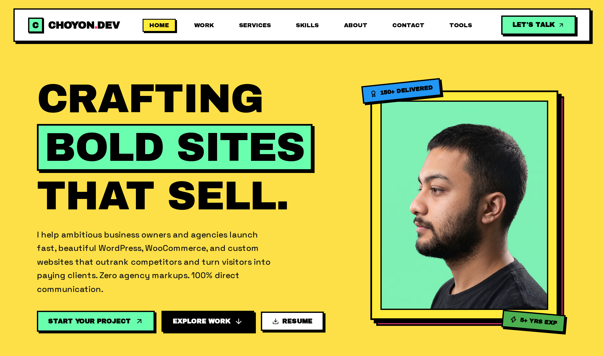
</p>

### 2. 📊 High-Contrast Stats Ribbon
Clean metrics banner showcasing completed projects, client satisfaction rate, and production uptime with neobrutalist badge styling.

<p align="center">
  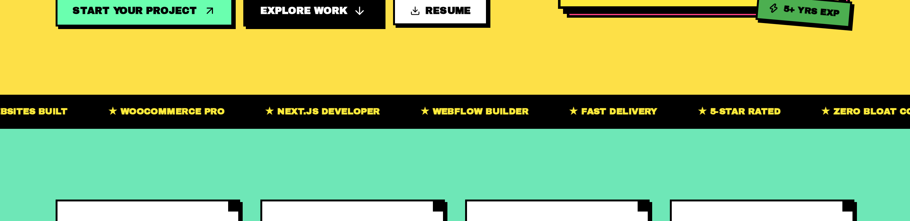
</p>

### 3. 💼 Featured Projects Showcase
Interactive card grid with category tags, live preview links, GitHub source buttons, and tactile click elevation.

<p align="center">
  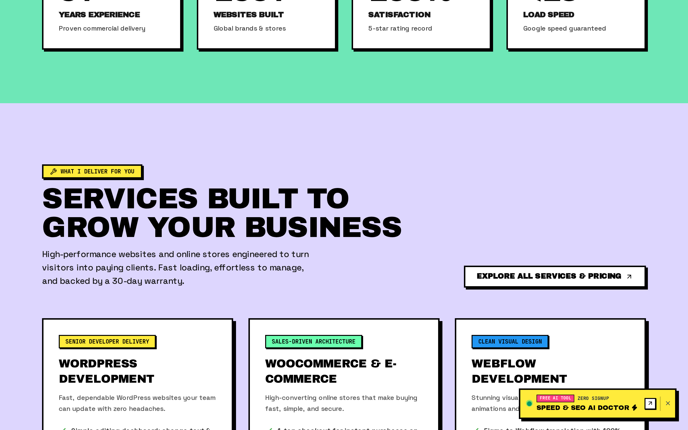
</p>

### 4. 🛠️ Services Preview Grid
Card layout displaying development offerings with visual icons, tech stacks, and direct links to dedicated deep-dive service pages.

<p align="center">
  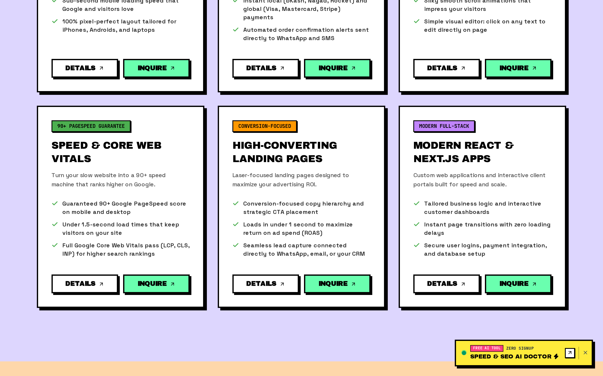
</p>

### 5. 🗺️ Step-by-Step Workflow & Development Process
A structured milestone roadmap demonstrating client workflow from discovery and architecture to deployment and optimization.

<p align="center">
  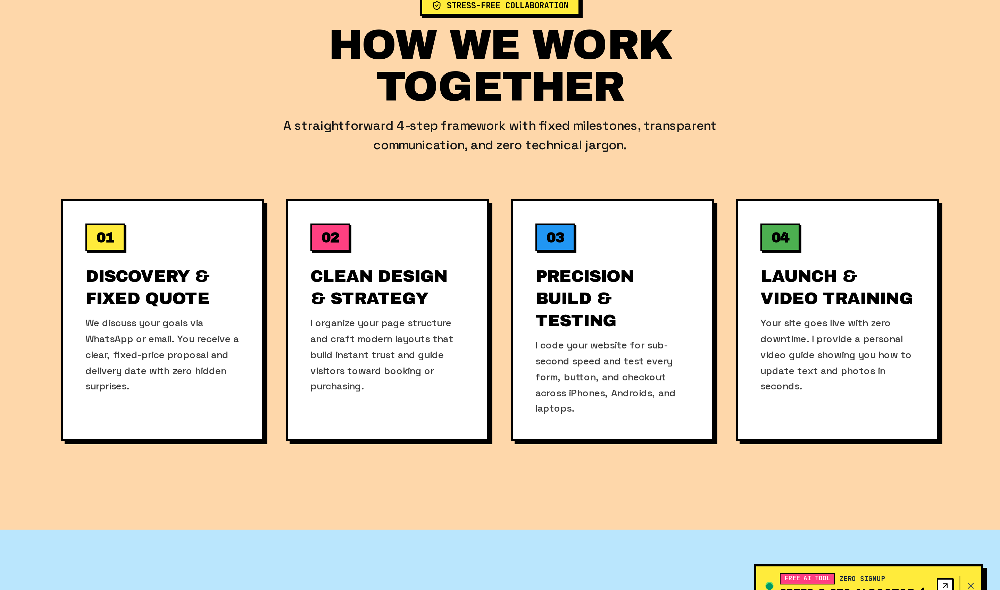
</p>

### 6. ⭐ Client Testimonials & Social Proof
High-contrast review cards highlighting client recommendations, ratings, and project outcomes.

<p align="center">
  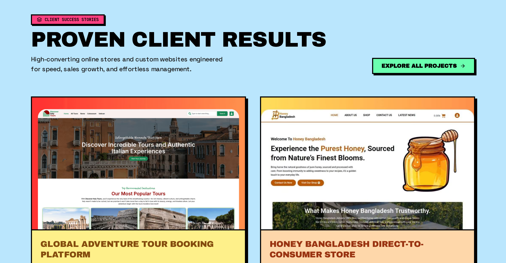
</p>

### 7. ❓ Interactive FAQ Accordion
Expandable accordion components providing upfront answers regarding tech stack, timelines, pricing, and communication.

<p align="center">
  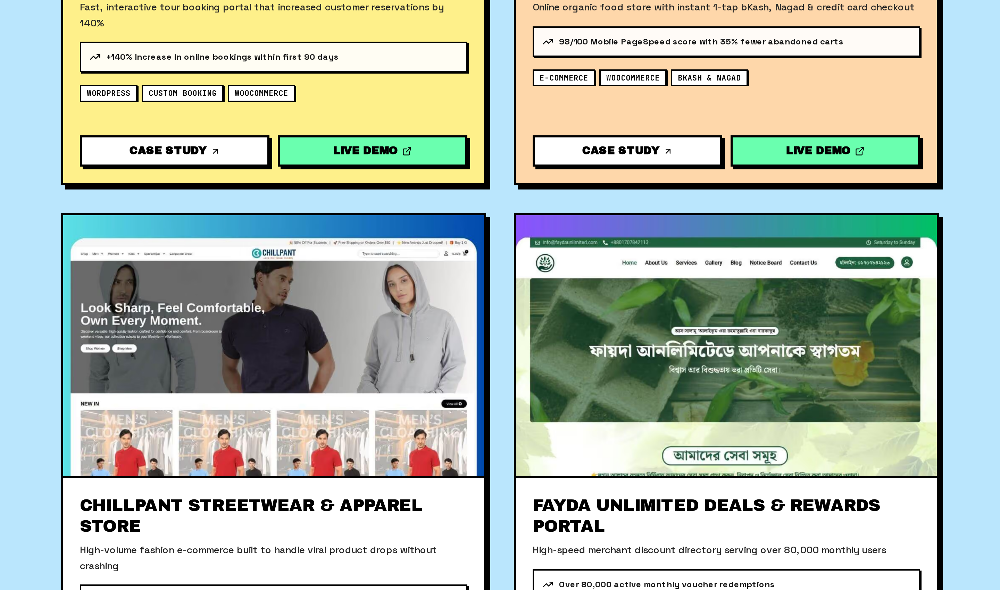
</p>

### 8. 📂 Dedicated Work & Portfolio Page (`/work`)
Comprehensive portfolio repository featuring multi-tag filters (Full-Stack, Next.js, AI, Mobile, Design) and modal deep-dives.

<p align="center">
  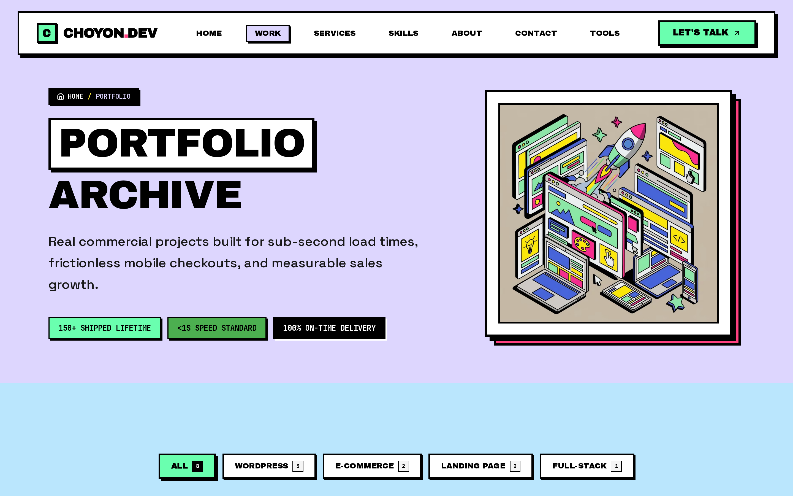
</p>

### 9. 💳 Services & Tiered Pricing Matrix (`/services`)
Transparent pricing matrix (Starter, Pro, Enterprise) with deliverable checklists, turn-around times, and instant booking CTAs.

<p align="center">
  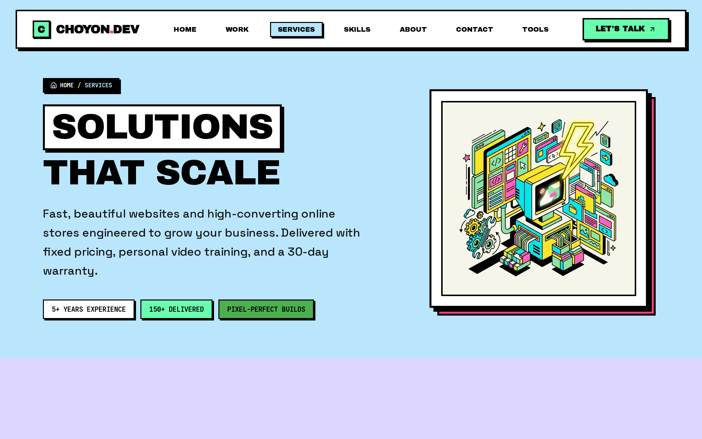
</p>

### 10. 📑 Service Detail Page Breakdown (`/services/[slug]`)
Deep-dive pages for specific services with custom breadcrumbs, process steps, tech specifications, and SEO metadata.

<p align="center">
  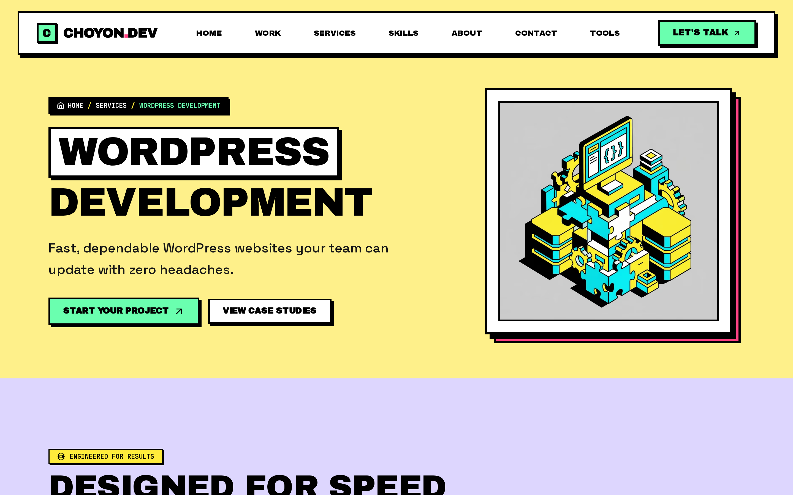
</p>

### 11. 🧭 Interactive Tools Directory (`/tools`)
A dedicated hub showcasing interactive micro-applications that provide value upfront to prospective clients. More high-converting client acquisition micro-apps will be continuously added here in upcoming template updates.

<p align="center">
  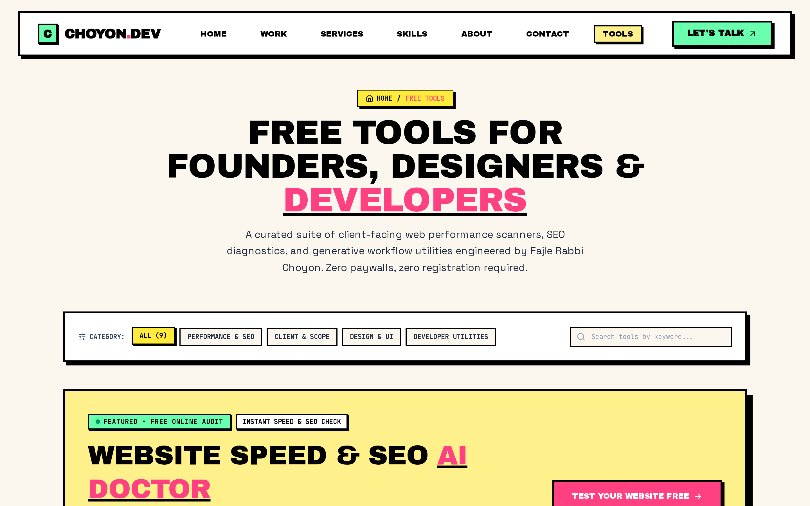
</p>

### 12. 🩺 Website Speed & SEO AI Doctor (`/tools/website-speed-seo-ai-doctor`)
Interactive performance audit tool that analyzes websites and automatically prompts visitors to book a consultation.

<p align="center">
  
</p>

### 13. 🧩 CMS & Tech Stack Matchmaker (`/tools/cms-tech-stack-matchmaker`)
Multi-step interactive questionnaire helping clients determine their optimal architecture (Next.js, WordPress, Webflow, Shopify) and funnels them directly into your booking queue.

<p align="center">
  
</p>

### 14. 👤 About & Career Journey (`/about`)
Personal story, professional philosophies, and chronological experience roadmap.

<p align="center">
  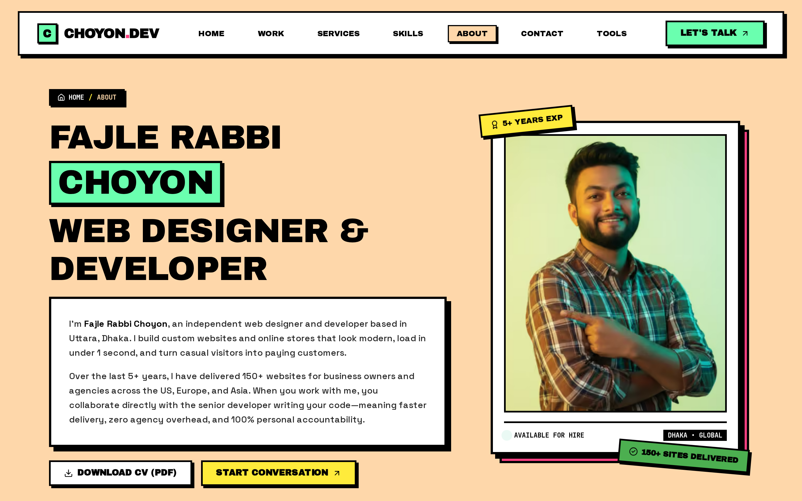
</p>

### 15. ⚡ Skills Proficiency Matrix (`/skills`)
Categorized technical skill grid with mastery indicators and technology badges.

<p align="center">
  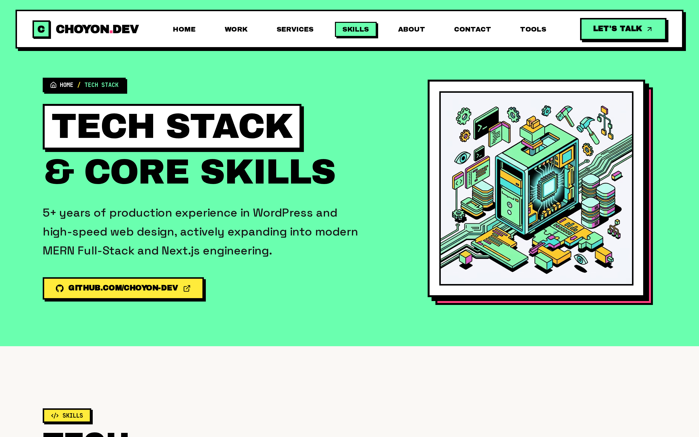
</p>

### 16. 📬 Contact & Consultation Booking Drawer (`/contact`)
Slide-over neo-brutalist consultation drawer with calendar date picker, direct email triggers via Resend API, and dynamic PDF quote/resume generation with `jsPDF`.

<p align="center">
  
</p>

### 17. 📱 100% Tactile & Responsive Mobile View
Engineered to deliver crisp typography and smooth touch interactions on all mobile screens.

<p align="center">
  
</p>

---

## ⚡ Tech Stack Architecture

- **Framework**: Next.js 16 (App Router, Server Components & Dynamic Route Handlers)
- **UI Library**: React 19
- **Styling**: Tailwind CSS v4 with custom Neo-Brutalist tokens & utility classes
- **Animation**: Framer Motion 13 (spring physics, layout transitions, animated badges)
- **Icons & Graphics**: Lucide React + Custom SVG Tech Badges & Neo Lottie integrations
- **Forms & Email**: React Hook Form ready + Resend API integration
- **Document Export**: jsPDF for dynamic client quotes and resume downloads
- **SEO & Performance**: Dynamic `sitemap.ts`, `robots.ts`, JSON-LD schema, open graph previews

---

## 📦 Complete Developer & Agency License

Get full unrestricted access to the complete production codebase with zero restrictions:

- ✅ **Full Source Code Access**: Production-ready Next.js 16, React 19, Tailwind v4 & Framer Motion
- ✅ **Personal & Commercial Rights**: Build your personal developer portfolio or deploy unlimited client websites
- ✅ **All Included**: Lead-gen Speed Doctor & CMS Matchmaker micro-tools, booking drawer, dynamic PDF generator & turnkey SEO
- ✅ **Lifetime Updates**: Receive all future template improvements
- ✅ **Complete Documentation**: 5-minute setup and customization guide

<p align="center">
  <a href="https://choyondev.gumroad.com/l/NexJsNeo-BrutalistDeveloperAgencyPortfolioTemplate" target="_blank">
    
  </a>
</p>

<p align="center">
  <sub>Instant digital delivery and full repository access via Gumroad.</sub>
</p>

---

## 🚀 Quick Start Guide

Once you download your template package:

### 1. Install Dependencies
```bash
npm install
# or
pnpm install
```

### 2. Configure Environment Variables
Copy `.env.example` to `.env.local`:
```bash
cp .env.example .env.local
```
Add your credentials:
```env
RESEND_API_KEY="re_123456789"
CONTACT_EMAIL="your-email@example.com"
NEXT_PUBLIC_SITE_URL="https://yourdomain.com"
```

### 3. Personalize in 5 Minutes
All personal data, projects, experience, services, and FAQ items are centralized in a single configuration file:
- Edit: `src/data/portfolioData.ts` to replace your name, bio, social links, and projects.

### 4. Run Locally
```bash
npm run dev
```
Open [http://localhost:3000](http://localhost:3000) to view your site.

---

## Tags

`nextjs-template` · `neo-brutalism` · `developer-portfolio` · `react-19` · `tailwind-v4` · `framer-motion` · `freelance-portfolio` · `agency-template` · `portfolio-website` · `client-acquisition` · `resend-email` · `choyon-dev` · `full-stack-portfolio` · `developer-resume`
