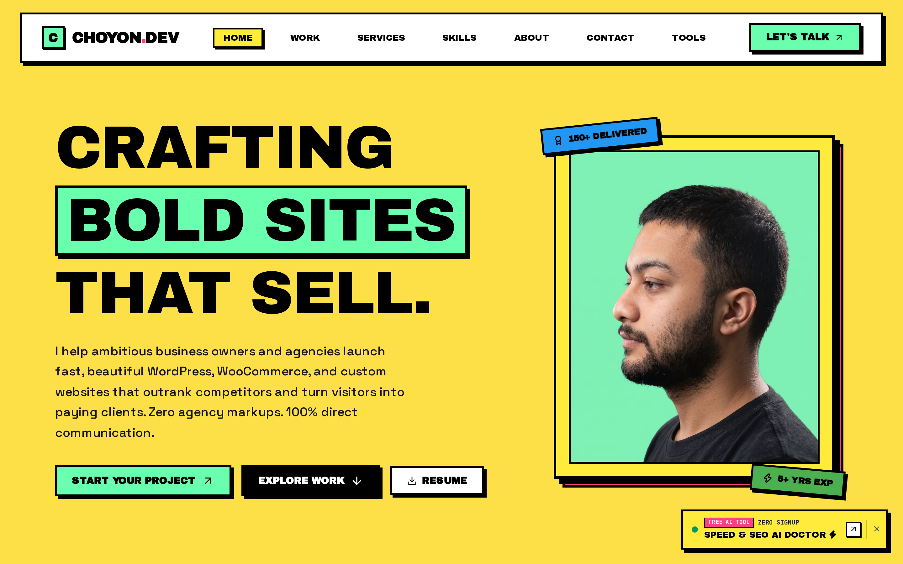
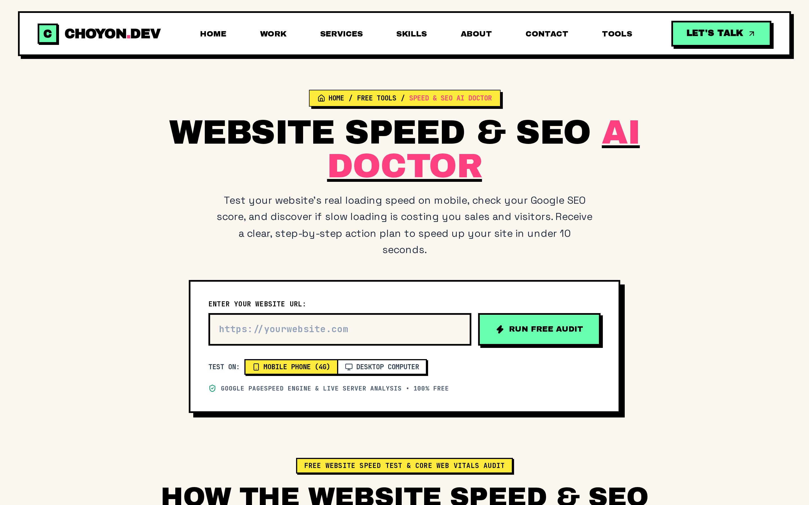
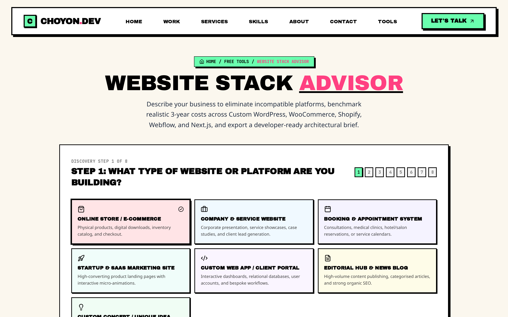
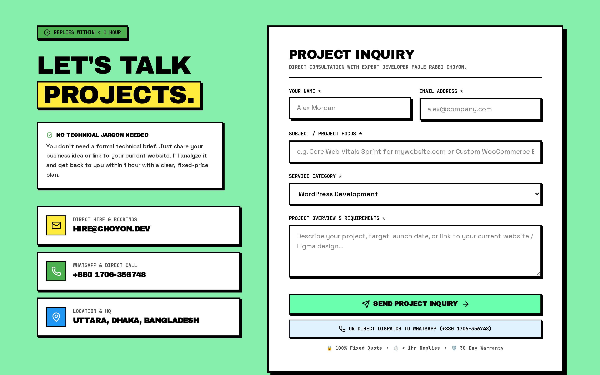
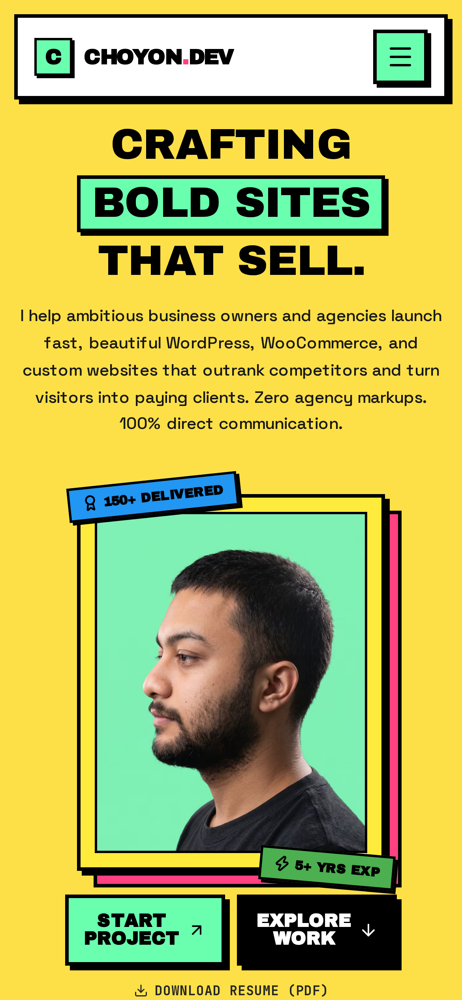

# ⚡ NeoPort 16 — The Ultimate Neo-Brutalist Developer & Agency Portfolio Engine

<p align="center">
  
</p>

<p align="center">
  <a href="https://choyon.dev" target="_blank">
    
  </a>
  <a href="https://yourstore.lemonsqueezy.com/buy/your-id" target="_blank">
    
  </a>
</p>

<p align="center">
  
  
  
  
  
  
  
</p>

---

## 🌟 Overview

**NeoPort 16** is not just another passive developer portfolio. It is a high-octane **Client Acquisition Operating System** crafted with an authentic **Neo-Brutalist** aesthetic: raw visual tension, crisp 2px black framing, hard non-blurred offset shadows (`4px 4px 0 #000`), and electric neo-mint (`#6AFFAF`) and hot pink (`#FF4081`) accents.

Built from scratch on the bleeding edge of the React ecosystem (**Next.js 16 + React 19 + Tailwind CSS v4**), it comes pre-loaded with **interactive lead-generation micro-apps**, dynamic service pricing matrices, client consultation booking drawers, and automated PDF resume/proposal generation.

🔗 **Explore the Live Site**: [https://choyon.dev](https://choyon.dev)

<p align="center">
  
</p>

---

## 📸 Section-by-Section Showcase

### 1. ⚡ High-Impact Hero & Marquee Ticker
Bold typography with electric neo-mint highlights, floating interactive skill pills, real-time availability indicator, and smooth infinite horizontal marquee ticker.

<p align="center">
  
</p>

### 2. 🧲 Built-In Lead Generation Micro-Tools
Turn passive recruiters and prospective clients into qualified leads directly on your site:
- **Website Speed & SEO AI Doctor** (`/tools/website-speed-seo-ai-doctor`): Allows visitors to test site performance and triggers an instant consultation audit pitch.
- **CMS & Tech Stack Matchmaker** (`/tools/cms-tech-stack-matchmaker`): An interactive multi-step questionnaire recommending optimal architectures and booking your services.

<p align="center">
  
  
</p>

### 3. 💼 Work Showcase & Project Modals
- High-contrast Neo-Brutalist cards with animated hover offsets.
- Multi-tag filtering system (Full-Stack, Next.js, AI, Mobile, Design).
- Project detail modals with metrics, architecture breakdowns, live demo links, and GitHub links.

<p align="center">
  
</p>

### 4. 📦 Agency-Ready Services & Tiered Pricing
- Individual service breakdown pages with customized SEO metadata (`/services/[slug]`).
- Tiered pricing tables (Starter, Pro, Enterprise) with transparent deliverable checklists.
- Interactive FAQ accordions and interactive workflow milestone roadmaps.

<p align="center">
  
</p>

### 5. 📬 Client Inquiry & Booking Drawer
- Slide-over Neo-Brutalist consultation drawer with schedule selection and inquiry form.
- Pre-wired **Resend API** integration for instant email delivery directly to your inbox.
- One-click **PDF Proposal & Resume Generator** powered by `jsPDF`.

<p align="center">
  
</p>

### 6. 📱 100% Mobile Responsive
Meticulously engineered to look crisp and feel tactile on any device from iPhone mini to 4K desktop screens.

<p align="center">
  
</p>

---

## ⚡ Tech Stack Architecture

- **Framework**: Next.js 16 (App Router, Server Components & Dynamic Route Handlers)
- **UI Library**: React 19
- **Styling**: Tailwind CSS v4 with custom Neo-Brutalist tokens & utility classes
- **Animation**: Framer Motion 13 (spring transitions, layout animations, floating badges)
- **Icons & Graphics**: Lucide React + Custom SVG Tech Badges & Neo Lottie integrations
- **Forms & Email**: React Hook Form ready + Resend API integration
- **Document Export**: jsPDF for dynamic client quotes and resume downloads
- **SEO & Performance**: Dynamic `sitemap.ts`, `robots.ts`, JSON-LD schema, open graph previews

---

## 🛒 Simple One-Price Developer License ($29 Flat)

No complicated tiers. No monthly subscriptions. Just **one flat price** for everything:

- ✅ **Full Source Code Access** (Next.js 16 + React 19 + Tailwind v4 + Framer Motion)
- ✅ **Personal & Commercial Use**: Use for your own portfolio or customize it for unlimited client websites
- ✅ **All Included**: Lead-gen AI Doctor & CMS Matchmaker tools, booking drawer, PDF export, SEO engine
- ✅ **Lifetime Updates**: Get all future improvements and fixes
- ✅ **Complete Documentation**: Step-by-step customization guide in 5 minutes

<p align="center">
  <a href="https://yourstore.lemonsqueezy.com/buy/your-id" target="_blank">
    
  </a>
</p>

*(Payments processed securely via Lemon Squeezy — supports Credit/Debit Cards, Apple Pay, Google Pay, and PayPal with direct international payouts to Bangladesh).*

---

## 🚀 Quick Start (For Template Buyers)

Once you download your template package:

### 1. Install Dependencies
```bash
npm install
# or
pnpm install
```

### 2. Configure Environment Variables
Copy `.env.example` to `.env.local`:
```bash
cp .env.example .env.local
```
Add your credentials:
```env
RESEND_API_KEY="re_123456789"
CONTACT_EMAIL="your-email@example.com"
NEXT_PUBLIC_SITE_URL="https://yourdomain.com"
```

### 3. Personalize in 5 Minutes
All personal data, projects, experience, services, and FAQ items are centralized in a single configuration file:
- Edit: `src/data/portfolioData.ts` to replace name, bio, social links, and projects!

### 4. Run Locally
```bash
npm run dev
```
Open [http://localhost:3000](http://localhost:3000) to view your site.

---

## 🏷️ SEO & Search Topics

`nextjs-template` · `neo-brutalism` · `developer-portfolio` · `react-19` · `tailwind-v4` · `framer-motion` · `freelance-portfolio` · `agency-template` · `portfolio-website` · `client-acquisition` · `resend-email` · `choyon-dev`
